# Prototyping Motion with Keynote
Simple animations are a great way to add life to our products, but mocking them up can be more complex than it needs to be. Enter Keynote.

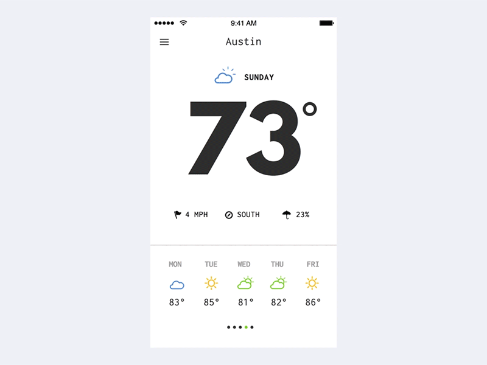

## Introduction
With all the modern ways to prototype motion for the web and mobile, sometimes things can get a bit overwhelming. Framer this and Origami that, and soon you're spending more time coding your animation than designing it. 

Don't get me wrong, I love those tools, but sometimes a simple animation requires a simple tool. Here comes Keynote to the rescue, a presentation app most of us already have on our machine (assuming you're on OSX). For one-state interactions, like menus opening and closing, modals appearing and disappearing, loading and displaying content— Keynote is king.

Keynote has a set of simple, visual tools for building animation (normally for Powerpoint-like presentations). We're going to use these transitions, between slides, to animate our interface. While I use Keynote for a heck of a lot more, today we're going to look at Magic Move, a simple "animate the difference" transition that's handy for just about anything.

From Keynote we'll export a movie file, and from that we'll make a GIF, both perfect for sharing your animation with the team, your developer, or Dribbble.

So many of my projects lately don't have **just one** mockup or design, but a series of smaller, flexible deliverables. Style guides and responsive states and animation direction and documentation have taken the place of the PSD. Unexpectedly (to me, at least), Keynote has turned out to be a small, but important, soldier in that battle.

In this lesson we'll look at animating a simple card-style menu. Our menu enters from the bottom of the screen and leaves through the top, which is a perfect example of a slightly peculiar animation you might want to document before build. Let's go!

### Step 1

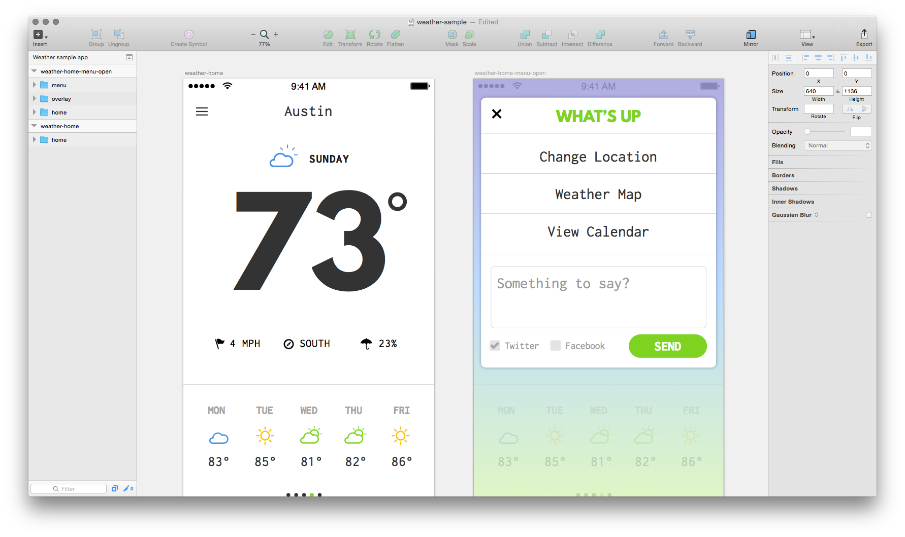

To create our animation, we'll need all the individual pieces from our design saved out as PNGs. Sketch makes this pretty simple, so we'll start by breaking our design into pieces. Since we're animating an off-canvas menu, we'll need to save our main app screen, the menu card, and the colored overlay.

### Step 2

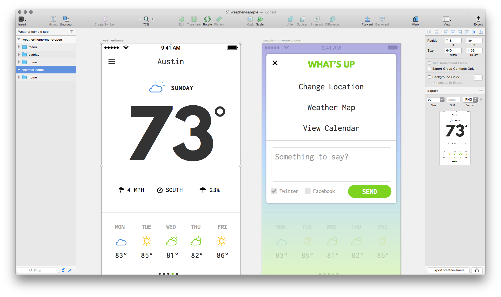

When marking things for export, we've got a few options: artboards, groups and slices. Our main app screen fills an entire artboard, so that's the first thing we'll mark for export. Simply select the main artboard, then click the plus icon (+) in the "Make Exportable" section of the Inspector (right side toolbar, near the bottom).

### Step 3

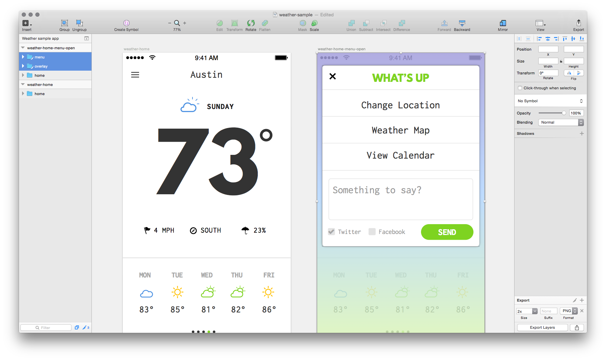

We're also going to need the menu card and the colored overlay, which we can export by the group(s) that contain them. Simply select each group, then click the plus icon (+) in "Mark Exportable" to add them to the party. Since Sketch gives us the option, we'll want to export all these images as 2X PNGs. The larger export size will help keep things crisp when we build and export our animation in Keynote.

### Step 4

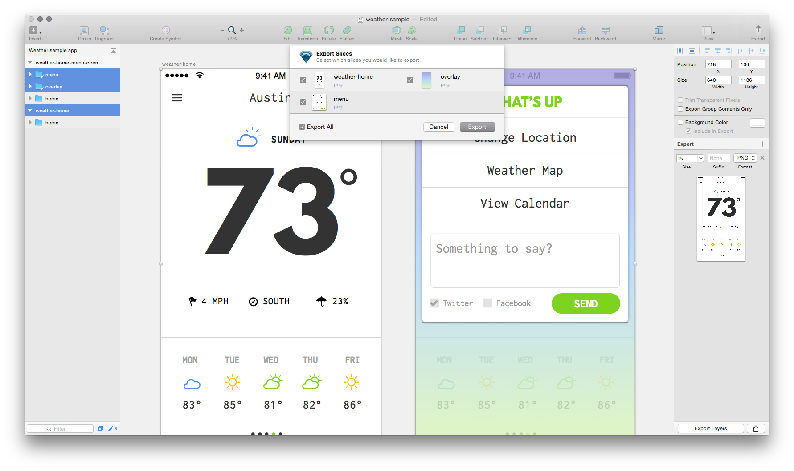

To export all our PNGs at once, we're going to use the Export tool in the top right of the Sketch window. Exporting all assets at once is a great way to keep everything in sync as you make changes during the design process. Click Export, make sure each asset is selected, then save everything to a folder.

### Step 5

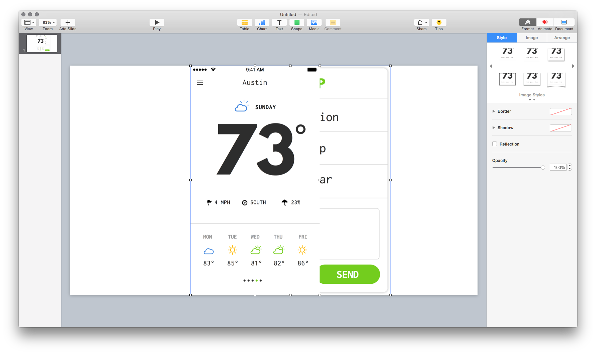

With all our PNGs exported, it's time to bring them into Keynote. Create a new Keynote file, making sure to select Widescreen when you do (aside from the aspect ratio, Widescreen presentations seem to be larger overall, so I usually use them). Starting with a blank slide, drag and drop all your images from Finder into Keynote.

### Step 6

Our goal here is to create two slides, basically a "before" and "after". The game plan is to make two states, 1) the regular app view, and 2) the app with the menu open. The animation is going to take place **between** the slides, using Keynote's "Magic Move" transition.

### Step 7

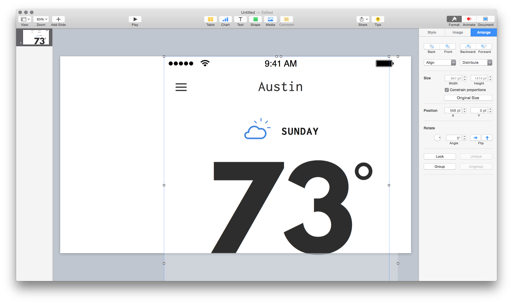

With all images still selected, hop on over to the "Arrange" section of the Inspector (right sidebar in Keynote). There we need to hit the "Original Size" button to make sure all our images start at a matching ratio (when importing, Keynote sometimes sizes things relative to the slide).

### Step 8

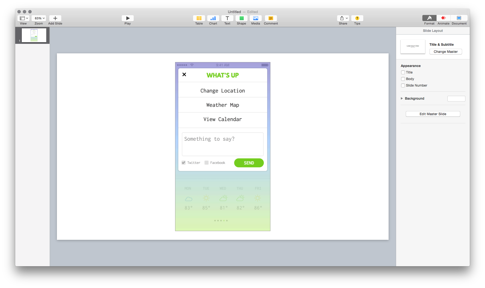

Since our "after" slide has more pieces in play, let's actually build that one first. With the images at their original size, assemble your original design, like the pieces of a puzzle.

Make sure things are layered in the correct order (main app screen on bottom, colored overlay in the middle, menu card on top) and aligned properly. Once it looks correct, group everything and size it down to fit within the slide. After sizing, we can ungroup things.

### Step 9

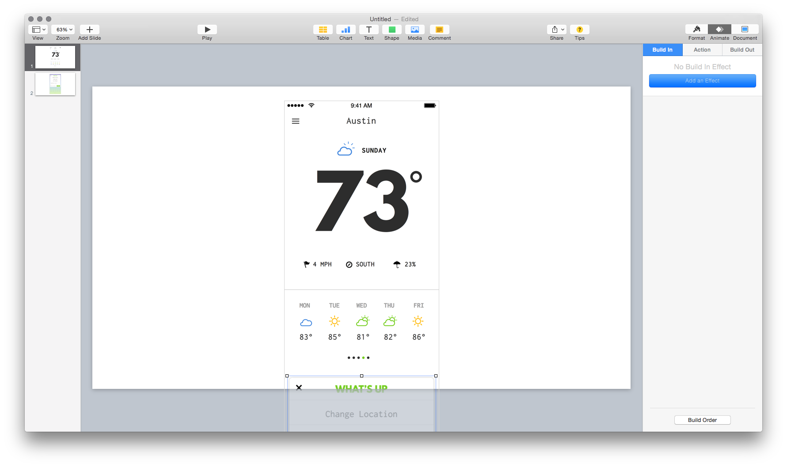

To make the "before" slide, let's duplicate our current slide and make some simple changes. First up, we're going to drop the colored overlay top an opacity of zero. After that, we're going to move the open menu card outside the bounds of the app screen, aka off-canvas (to the bottom of the screen, in this case). The differences between these two slides is what allows Keynote to create the eased transition. Speaking of which...

### Step 10

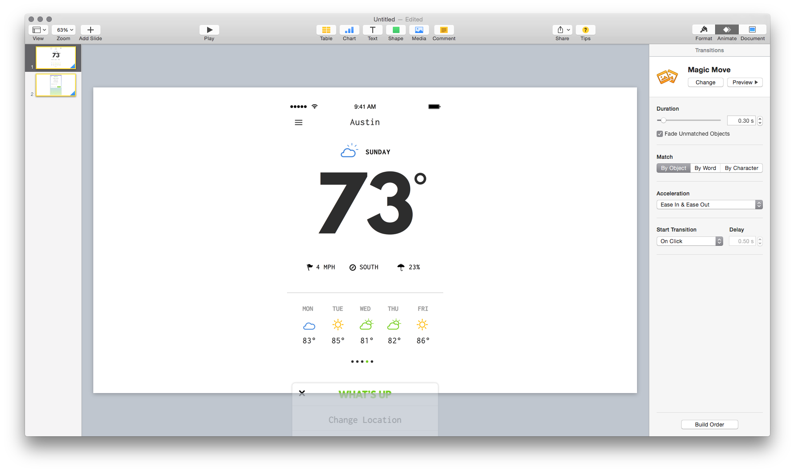

To enable the transition we're after, select both slides in Keynote's left pane, then choose "Magic Move" from the transition palette. Now would also be a good time to put our "before" and "after" slides in order, if you haven't already done so. First up would be the plain app screen, followed by the slide with the open menu card visible.

### Step 11

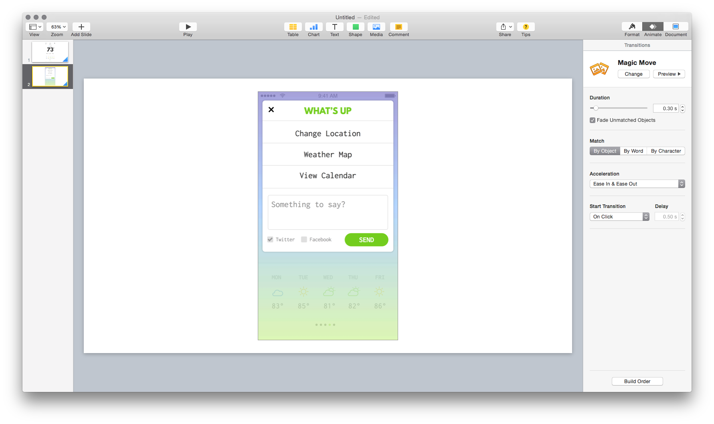

Magic Move works by easing the difference it finds between the slides. Since the colored overlay is set to 0% opacity on the "before" slide but 100% on the "after", Keynote will fade the colored overlay into existence, at whatever speed we want to set. Similarly, Magic Move will slide the menu card into view from its original position, off-canvas from the bottom of the app screen.

### Step 12

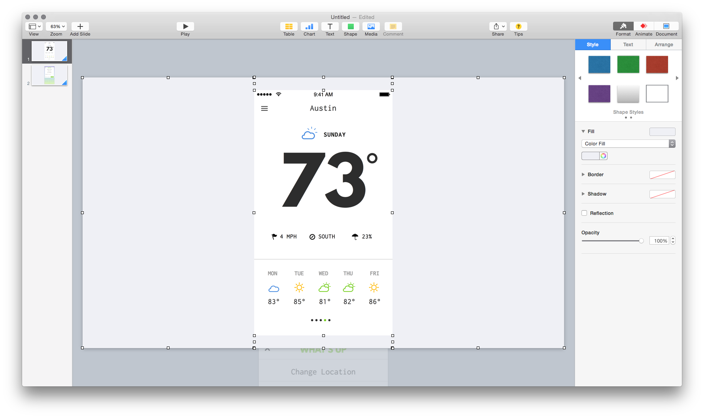

Speaking of off-canvas, now might be a good time to build the matte around our app screen, so that objects that enter and leave the screen actually hide when doing so. With Keynote's rectangle tool, simply draw 4 light gray rectangles, covering from the edge of the slide to the edge of our app screen. Basically we're making a mask, but in reverse, so think of it like the matte around a photo in a picture frame (the slide is the frame, the app screen is the photo).

### Step 13

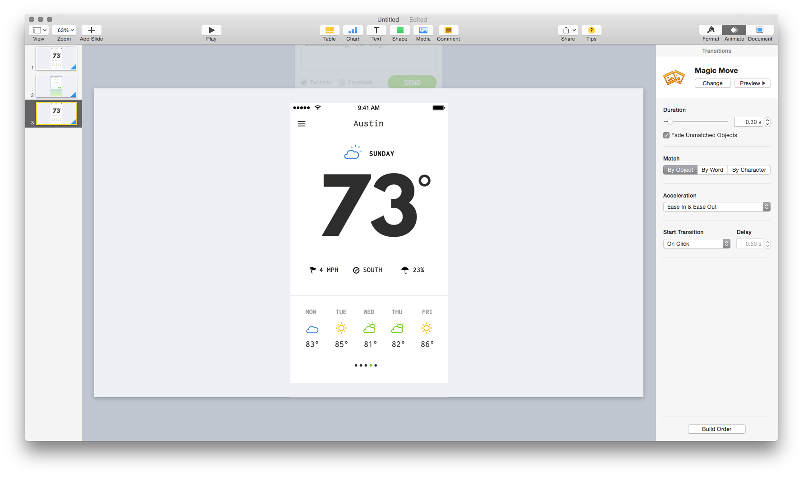

To complete the effect, we need to make one more slide, coming after the "after". In this slide, the colorful overlay will be back to 0% opacity, and the menu card will be off-canvas (but to the north). When the animation loops, it'll make a full chain of the card coming into view from the bottom, then leaving out of the top of the screen.

### Step 14

At any point, to test the effect, simply start the presentation. If you want to tweak the speed, you can select all slides and change them at once.

### Step 15

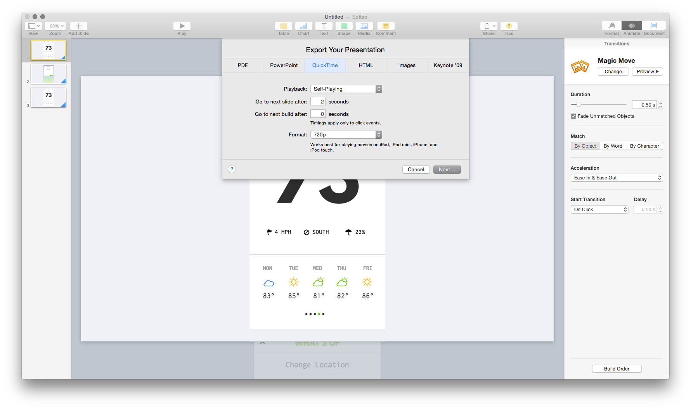

With our animation working smoothly, we can export an M4V file to show it off. Head to File > Export > QuickTime. Select a couple of seconds for "Go to next slide" and zero seconds for "Go to next build". Export your shiny new M4V.

### Step 16

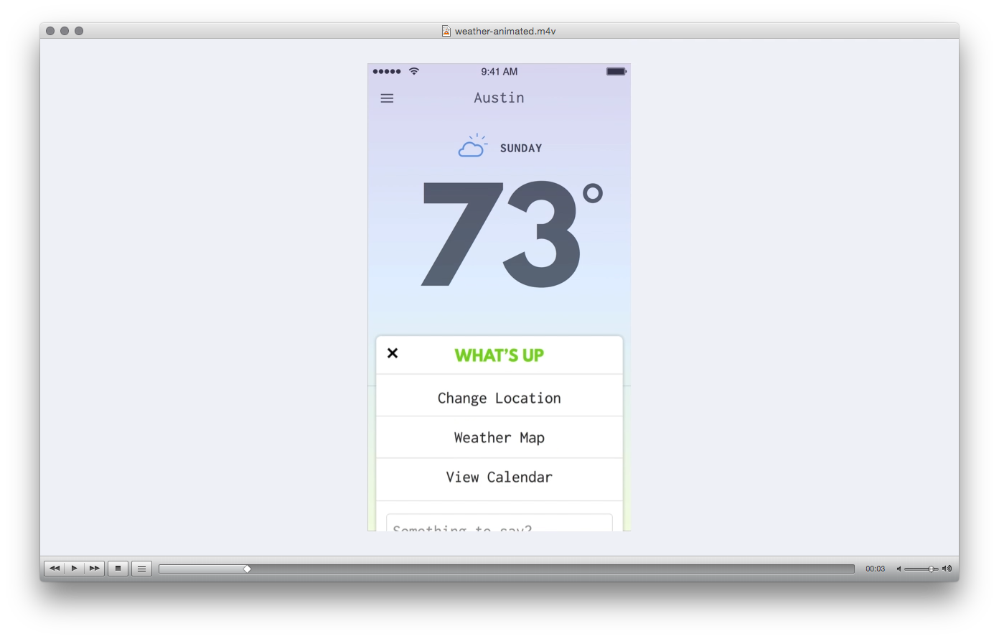

Open the M4V and view your animation. If you'd like, you could stop now and share this M4V with your team (or developer). If you're the showy type, you might want to consider...

### Step 17

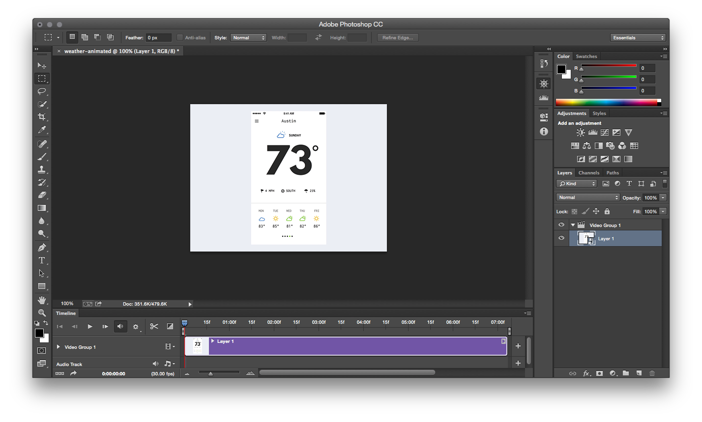

Making a GIF, probably the easiest way to share this thing online. To get started, drag your M4V into Photoshop (yes, you can do that). Now's a great time to adjust things like the canvas size and overall image size. Since I'm heading to Dribbble, I'll go with 400x300. You might also need to snip a bit off the end of your animation, if Keynote included the "Fade to Black" at the end. Simply drag the clip a few seconds shorter.

### Step 18

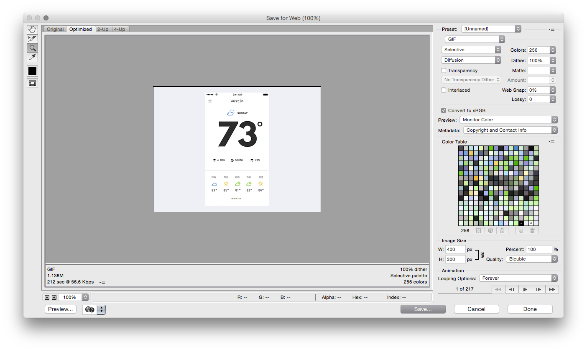

Enter the "Save for Web" dialog to export your GIF. Make sure you set the repeat to "Forever". You can try restricting colors to reduce the file size, but really anything under a couple MB here would be considered normal. File-size-wise, the M4V may well be smaller, but there's always something special about a GIF.

### Step 19

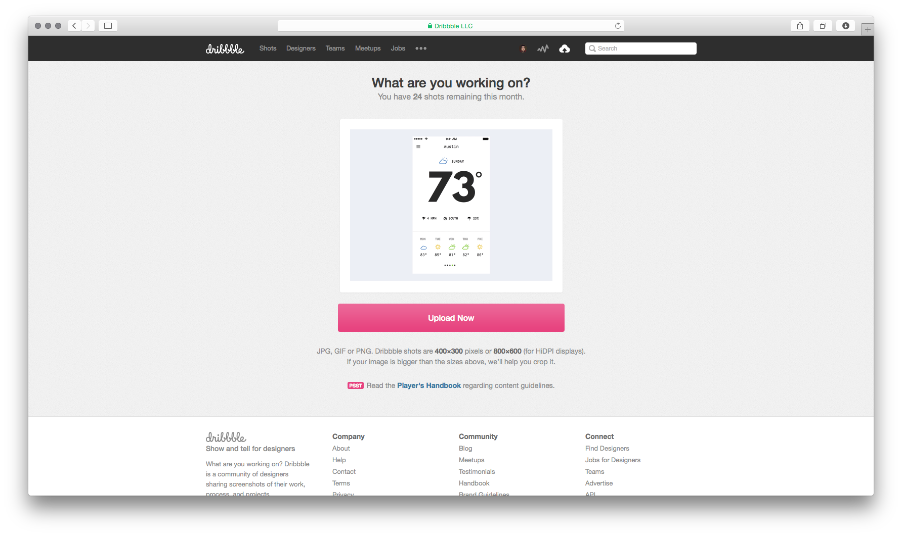

You're done! Email or Dribbble or Behance this bad boy out into the world and rest assured your design will be communicated with the proper motion and direction you've been seeing in your head for weeks now.

### Tip 1
Coming soon...

### Tip 2
Coming soon...

### Tip 3
Coming soon...

### Tip 4
Coming soon...

# Files
- [Sketch File](weather-sample.sketch)
- [Keynote File](weather-sample.key)
- GIF:

# Credit

- Clark Wimberly
- User-centric design + dev
- [clarklab.com](http://clarklab.com)
- [@clarklab](http://twitter.com/clarklab)

